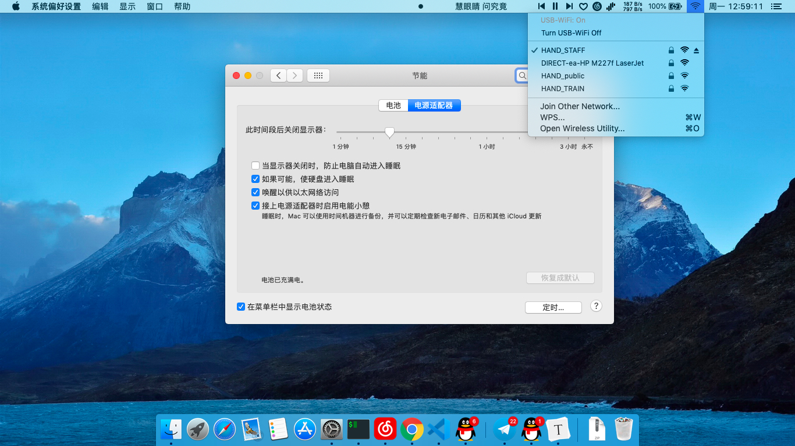
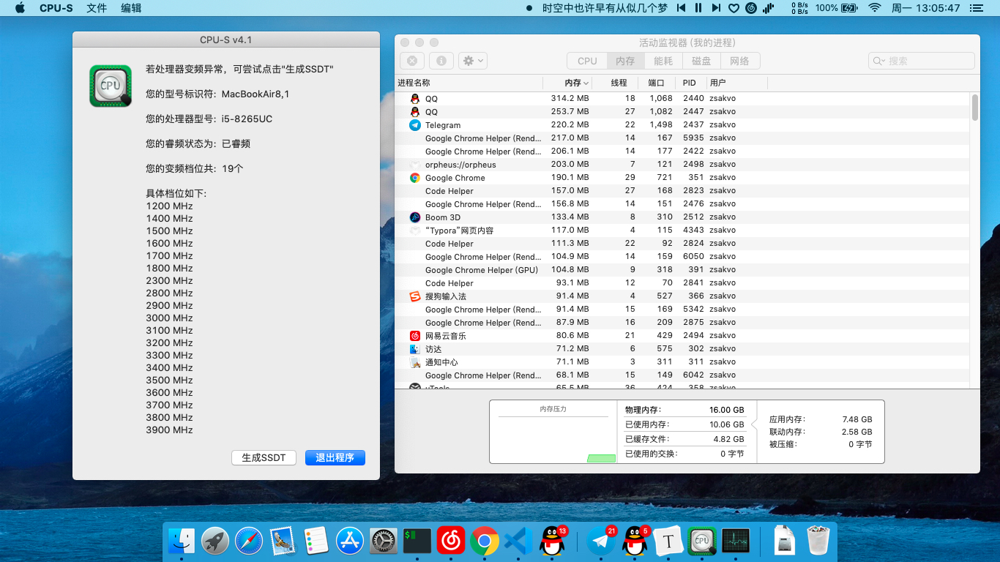

# HP 348 G5 黑苹果配置

### 2019.11.3 更新:

1，系统版本升级至 `MacOS 10.15.1`

2，使用 `VirtualSMC` 替代 `FakeSMC`

3，显卡仿冒 `Intel Iris Plus Graphics 655` 进行驱动

4，应用部分 `hotpatch`

5，升级必要驱动版本

6，替换原装网卡为 `DW1820A`，驱动内置 wifi 以及 蓝牙

7，精简 `config.plist`

---

系统版本：MacOS 10.14.6，驱动状况如下：

1. 声卡：型号为 ALC236，注入 ID：13，使用 AppleALC 仿冒，顺利加载；
2. 网卡：ac 9560` 的无线网卡截止到目前还是无解，使用 USB 网卡替代之；
3. 显卡：Intel UHD Graphics 620，直接使用 `whatevergreen` 驱动，睡眠唤醒正常；
4. `intel` 蓝牙直接屏蔽
5. 电池信息正常；
6. 触摸板：使用 `VoodooI2C` 驱动，目前以轮询模式驱动，不是很完美；
7. 显示器亮度调节正常；可自行修改亮度调节快捷键：`F2` 和 `F3`
8. USB 端口识别，未进行端口订制；摄像头、无线网卡已内建，避免睡眠问题；
9. 已注入 edid 信息，显示器颜色校正，色彩鲜艳并且不再偏蓝紫。

系统截图：

