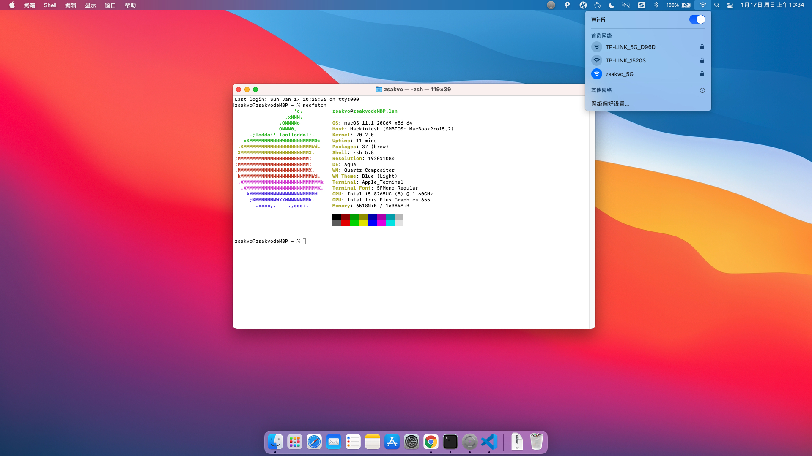

# HP 348 G5 黑苹果配置

### 2021.01.17 更新:

- 支持 MacOS 11.1
- 更新内置驱动程序版本
- 重建 USB 定制

### 2020.08.20 更新:

- 支持 MacOS Big Sur beta5
- OpenCore 升级为最新编译的 0.6.1 版本
- 更新内置驱动程序版本 (2020.08.20 编译)
- 根据建议重新定制 `AppleAHCIPort.kext`（已更名 `CtlnaAHCIPort.kext`），并移除 `SATA-unsupported.kext` 来驱动硬盘，此次定制更加稳定，同时适用于 10.15 和 10.16
- 移除 i2c 相关驱动（触摸板暂时不可使用）

### 系统截图：

### 致谢：

- [Apple](https://www.apple.com) for macOS
- [Acidanthera](https://github.com/acidanthera/) for OpenCore and Other kexts
- [Acidanthera](https://dortania.github.io/OpenCore-Install-Guide/extras/big-sur/#supported-hardware) for `CtlnaAHCIPort.kext`
